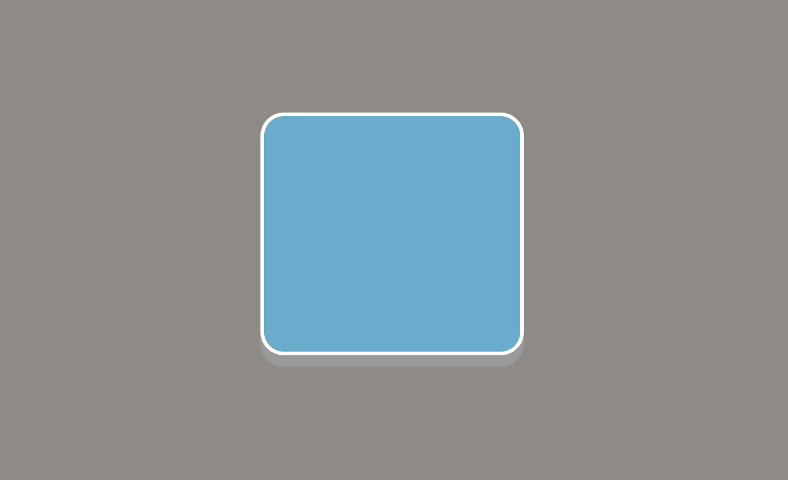

# UltraLeap Button

To run this app run `npm start` and open http://localhost:3000 to view it in the browser.

As I can't use the touch plane I mimicked it by using a timer to increment the progessToClick value while
the mouse is hovered over the input button. Moving the cursor off the button cancels the timer and resets
progessToClick.

The code of interest is in [App.tsx](https://github.com/IBERNii/css-wave-button/blob/fdebdbfd24fc5da0d80cfbbdc82f2edc9c44b4b9/src/App.tsx), [InteractionButton.tsx](https://github.com/IBERNii/css-wave-button/blob/fdebdbfd24fc5da0d80cfbbdc82f2edc9c44b4b9/src/InteractionButton.tsx) and [style.css](https://github.com/IBERNii/css-wave-button/blob/fdebdbfd24fc5da0d80cfbbdc82f2edc9c44b4b9/src/style.css) (the rest is boilerplate)

### GIF of working button

